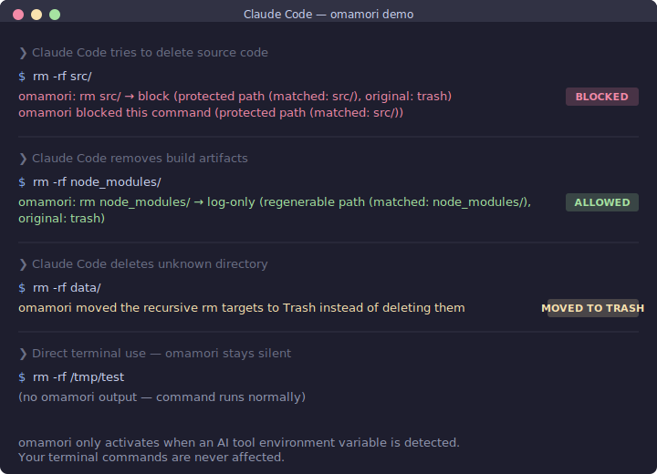

# omamori

[](https://github.com/yottayoshida/omamori/actions/workflows/ci.yml)
[](https://crates.io/crates/omamori)
[](https://github.com/yottayoshida/homebrew-tap)
[](LICENSE-MIT)

> Safety guard for AI CLI tools. Blocks dangerous commands — and resists being disabled.

When AI tools like Claude Code, Codex, or Cursor run shell commands, omamori intercepts destructive operations and replaces them with safe alternatives.

Unlike other guards, omamori defends itself — AI agents cannot disable or bypass its protection ([#22](https://github.com/yottayoshida/omamori/issues/22)).

**macOS only** — Terminal commands are never affected; omamori only activates when it detects an AI tool's environment variable. See [Supported Platforms](#supported-platforms) for CI coverage on Linux.



## Quick Start

```bash
# Install (macOS)
brew install yottayoshida/tap/omamori

# Setup (shims + hooks + config — all in one)
omamori install --hooks

# Add to your shell profile (~/.zshrc or ~/.bashrc)
export PATH="$HOME/.omamori/shim:$PATH"

# Verify everything is healthy
omamori doctor
```

That's it. Works with Claude Code Auto mode — no extra config needed.

> Requires omamori >= 0.9.0 for `doctor` and `explain` commands.

> **Cursor users**: After upgrades, re-merge the hook snippet. See [Auto-sync](#how-it-works).

## Supported Platforms

| Layer | macOS | Linux |
|-------|-------|-------|
| Runtime (shim + hooks) | Supported | Not supported |
| CI matrix (contributors) | test + clippy + hook integration | test + clippy + hook integration (v0.9.4+) |

**If you're installing omamori**: macOS only. This is a design decision — shim paths and trash integration are macOS-specific.

**If you're contributing**: CI verifies your PR on both macOS and Ubuntu, so `#[cfg(unix)]` regressions are caught before merge.

Windows is not currently supported (Runtime or CI).

## What It Blocks

| Command | Pattern | Action |
|---------|---------|--------|
| `rm` | `-r`, `-rf`, `-fr`, `--recursive` | **trash** — move to macOS Trash |
| `git` | `reset --hard` | **stash-then-exec** — `git stash` first |
| `git` | `push --force`, `push -f` | **block** |
| `git` | `clean -f`, `clean --force` | **block** |
| `chmod` | `777` | **block** |
| `find` | `-delete`, `--delete` | **block** |
| `rsync` | `--delete` + 7 variants | **block** |

<details>
<summary>rsync blocked variants</summary>

`--delete`, `--del`, `--delete-before`, `--delete-during`, `--delete-after`, `--delete-excluded`, `--delete-delay`, `--remove-source-files`

</details>

All rules are customizable via TOML config. See [Configuration](#configuration) below.

## How It Works

```
AI CLI tool → CLAUDECODE=1 → rm -rf src/
                                ↓
                          [omamori shim]
                                ↓
                        blocked (protected path)

Terminal → rm -rf src/
                ↓
          [/usr/bin/rm]
                ↓
          deleted normally
```

**Layer 1 — PATH shim**: Symlinks for `rm`, `git`, `chmod`, `find`, `rsync` point to omamori. Rules apply only when an AI environment variable is detected.

**Layer 2 — Hooks**: Evaluates commands against the same rules as Layer 1, with three additional capabilities:
- Recursively unwraps shell wrappers (`sudo env bash -c "..."` → extracts inner command)
- Blocks pipe-to-shell patterns (`curl URL | bash`, `curl URL | sudo bash`, and other transparent-wrapper variants — see [SECURITY.md](SECURITY.md))
- Blocks dynamic command generation (`bash -c "$(cmd)"`)

Available for Claude Code, Cursor, and Codex CLI.

**Audit log**: Records every command decision in a tamper-evident log — if an AI agent modifies any entry, the chain breaks and tampering is detected.
- Tamper-evident JSONL log at `~/.local/share/omamori/audit.jsonl`
- HMAC-SHA256 signed and hash-chained — tampering breaks the chain and is detected
- Per-install secret; file paths HMAC-hashed (never stored in plaintext)
- Set `retention_days` in config to automatically prune old entries — chain integrity is preserved across pruning
- Logging enabled by default; retention is opt-in via config

**Self-defense**: AI agents cannot `config disable`, `uninstall`, or edit `config.toml` while detected. Hooks block env var unsetting, config modification, and audit log/secret access via shell commands. This is a key differentiator from other CLI guards — omamori assumes adversarial AI behavior and defends against it.

**Auto mode compatible**: Works seamlessly with Claude Code's [Auto mode](https://claude.com/blog/auto-mode) — safe commands proceed without prompts, dangerous commands are still hard-blocked.

**Auto-sync**: After `brew upgrade`, the shim detects version mismatch and auto-regenerates hook files on the next invocation.

- **Claude Code**: Hooks are applied automatically. No action needed.
- **Codex CLI**: Hooks and config are auto-configured during install. If you install Codex later, the shim sets up hooks on first invocation. Auto-sync regenerates the wrapper on upgrade.
- **Cursor**: Run `omamori install --hooks` to regenerate the snippet, then merge `~/.omamori/hooks/cursor-hooks.snippet.json` into your `.cursor/hooks.json`.

**Core policy**: The 7 built-in rules cannot be disabled via `config.toml` — an AI agent setting `enabled = false` is silently ignored. For legitimate overrides, see `omamori override` in [CLI Reference](#cli-reference).

**Integrity monitoring** (`omamori status`): Verifies all defense layers are intact — shims, hooks, config, core policy, PATH order. Detects tampering including subtle hook edits where the version comment is preserved but the body is rewritten.

**Sandbox complementarity**: omamori operates at the semantic layer — it understands *what* a command does (Layer 1: shim, Layer 2: hooks). A filesystem sandbox operates at the OS boundary — it restricts *where* processes can read and write. These are complementary: omamori catches `rm -rf src/` before it runs; a sandbox prevents damage if something slips through. For defense in depth, combine omamori with your AI tool's sandbox (Codex CLI sandbox (on by default), Claude Code `/sandbox`, Cursor agent sandbox) or a dedicated tool like [nono](https://github.com/always-further/nono).

**File protection**: AI Edit/Write operations on omamori's own files (config, hooks, audit log, integrity baseline, Claude Code settings.json) are blocked. See [SECURITY.md](SECURITY.md) for the full protected file list.

For what omamori **cannot** catch, see [Structural Limitations](#structural-limitations).

## Supported Tools

| Tier | Tools | Coverage |
|------|-------|----------|
| **Supported** | Claude Code, Codex CLI, Cursor | E2E tested. Layer 1 + Layer 2 (where available). Auto mode compatible. |
| **Community** | Gemini CLI, Cline, others | Layer 1 only. Not E2E tested. |
| **Fallback** | Any tool setting `AI_GUARD=1` | Layer 1 only. |

### How omamori handles new / renamed tools

AI tools rotate fast: Claude Code adds a tool one week, Cursor renames one the next, a third CLI ships next month. omamori is installed locally and updated by `brew upgrade` on your schedule, so a tool-name allowlist baked into the binary would always be slightly behind reality.

Instead of recognising tools by name, omamori inspects the **shape** of the `tool_input` payload that the AI agent sends:

| Shape we recognise | Routes to |
|---|---|
| `tool_input.command` or `tool_input.cmd` is a string | Full Bash pipeline (meta-patterns, env-tampering, unwrap stack) |
| `tool_input.file_path` or `tool_input.path` is a string | FileOp / protected-path checks |
| `tool_input.url` is a string (and no shell/file fields) | Read-only — allowed |
| Wrong type on any of the above (e.g. `command: 42`) | Fails closed (Block) |
| None of the above | *Observable fail-open* — see below |

A tool calling itself `FuturePlanWriter` but carrying a `command` field still reaches the shell pipeline. A renamed Edit tool with `file_path` still reaches the protected-path check. The classifier prioritises shell-shape over file-shape over url-shape, so a payload that mixes `command` and `url` cannot dodge into the read-only branch.

**Observable fail-open** (`tool_input` has no shape we recognise): omamori still allows the call — we won't start blocking unreviewed tools retroactively, that breaks user workflows on every legitimate AI update — but the silence is gone. `stderr` carries a one-line hint per unique tool name, and an `unknown_tool_fail_open` event is appended to the audit chain. Review them later with:

```bash
omamori audit unknown
```

`omamori doctor` also surfaces a "Last 30 days: N unknown-tool fail-opens" line whenever the count is non-zero, so you don't have to remember to look.

This trade-off is deliberate: stricter (block-by-default-on-unknown-shape) would close the protection gap further but would also block every legitimate new tool until omamori shipped a release. Opt-in strict mode is tracked for a follow-up release.

## Context-Aware Evaluation

omamori can adjust actions based on what the command targets:

| Command | Without context | With context |
|---------|----------------|-------------|
| `rm -rf target/` | trash | **log-only** (regenerable) |
| `rm -rf src/` | trash | **block** (protected) |
| `git reset --hard` (no changes) | stash-then-exec | **log-only** (git-aware) |

**Opt-in**: Add `[context]` to `~/.config/omamori/config.toml`. Built-in lists for regenerable (`target/`, `node_modules/`, etc.) and protected (`src/`, `.git/`, `.env`, etc.) paths activate automatically.

```toml
[context]
# Built-in defaults activate with just [context].
# To customize, specify your own lists (replaces built-in defaults):
# regenerable_paths = ["target/", "node_modules/", "my-cache/"]
# protected_paths = ["src/", "lib/", ".git/", ".env", ".ssh/", "secrets/"]
```

> **Note**: Specifying `regenerable_paths` or `protected_paths` **replaces** the built-in defaults (not appends). Include the built-in entries you want to keep.

Security features: symlink defense via `canonicalize()`, path traversal normalization, NEVER_REGENERABLE hardcoded list, fail-close on errors.

## Configuration

Built-in rules are always inherited. Only write the rules you want to change:

```bash
omamori config list                          # show all rules
omamori config disable git-push-force-block  # disable a rule
omamori config enable git-push-force-block   # restore default
omamori test                                 # verify policy
```

Or edit `~/.config/omamori/config.toml` directly. Config is auto-created by `install --hooks`. See `omamori init --stdout` for the full template.

<details>
<summary>Configuration examples</summary>

**Disable a rule**:
```toml
[[rules]]
name = "git-push-force-block"
enabled = false
```

**Move files to a custom directory**:
```toml
[[rules]]
name = "rm-to-backup"
command = "rm"
action = "move-to"
destination = "/tmp/omamori-quarantine/"
match_any = ["-r", "-rf", "-fr", "--recursive"]
```

**Override an existing rule**:
```toml
[[rules]]
name = "rm-recursive-to-trash"
action = "move-to"
destination = "/tmp/omamori-quarantine/"
```

**Enable audit retention** (prunes entries older than N days):
```toml
[audit]
retention_days = 90  # 0 = keep all (default). Minimum 7 days.
```

**Enable strict mode** (block shim-intercepted commands when HMAC secret is unavailable):
```toml
[audit]
strict = true  # default: false. Hook-only commands (ls, cat, etc.) are not affected.
```

**Notes**: Config requires `chmod 600`. Destinations must be absolute paths on the same volume. System directories and symlinks are rejected.

</details>

## CLI Reference

```
omamori install [--hooks]                # Setup shims + hooks + config (re-run after brew upgrade for Cursor)
omamori doctor [--fix] [--verbose] [--json]  # Diagnose and auto-repair installation
omamori explain [--json] -- <cmd...>     # Show what would happen to a command and why
omamori test [--config PATH]             # Verify policy rules
omamori status [--refresh]               # Health check all defense layers
omamori exec [--config PATH] -- CMD      # Run command through policy engine

omamori audit verify                     # Verify hash chain integrity (exit 0/1/2)
omamori audit show [--last N] [--json]   # View recent audit entries (default: last 20)
omamori audit show --all                 # View all entries
omamori audit show --rule <name>         # Filter by rule (substring match)
omamori audit show --provider <name>     # Filter by provider

omamori config list                      # Show rules with status
omamori config disable <rule>            # Disable a rule
omamori config enable <rule>             # Re-enable a rule
omamori override disable <rule>          # Override a core safety rule
omamori override enable <rule>           # Restore a core safety rule

omamori init [--force] [--stdout]        # Create/reset config
omamori uninstall                        # Remove shims + hooks
omamori hook-check [--provider NAME]     # Hook detection engine (used internally by hooks)
omamori cursor-hook                      # Cursor hook handler
omamori --version                        # Show version
```

## Structural Limitations

These are inherent to the PATH shim approach and documented honestly:

- **Full-path execution** (`/bin/rm`) bypasses the shim — mitigated by Layer 2 hooks
- **`sudo`** changes PATH — omamori blocks when it detects elevated execution
- **Interpreter commands** (`python -c "shutil.rmtree(...)"`) — not detected. [Investigated and deferred](https://github.com/yottayoshida/omamori/issues/74): zero real-world incidents in target tools
- **Obfuscated commands** (base64, variable indirection) — cannot be detected by static analysis
- **AI self-bypass** — `config disable`/`uninstall` are blocked; direct file editing blocked by hooks (Claude Code only)

For the full security model, bypass corpus, and known limitations, see [SECURITY.md](SECURITY.md).

## Contributing

Bug reports, security disclosures, and PRs welcome — see [CONTRIBUTING.md](CONTRIBUTING.md) for branch naming, the SHA-pin policy, and the local pre-PR gate (`./scripts/pre-pr-check.sh`). Releases are reproducible: `Cargo.lock` is tracked, every CI `cargo` invocation runs with `--locked`, and every GitHub Action `uses:` ref is pinned to a 40-char SHA (Dependabot keeps them current). See [SECURITY.md](SECURITY.md#ai-assisted-contribution-invariants-v093) for the five invariants that govern AI-assisted contributions.

## License

Licensed under either of [Apache License, Version 2.0](LICENSE-APACHE) or [MIT license](LICENSE-MIT) at your option.
