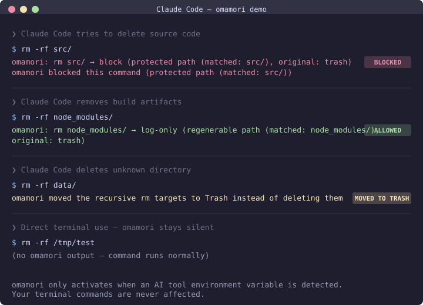

# omamori

[](https://github.com/yottayoshida/omamori/actions/workflows/ci.yml)
[](https://crates.io/crates/omamori)
[](https://github.com/yottayoshida/homebrew-tap)
[](LICENSE-MIT)

> Deterministic semantic guard for AI CLI tools. Blocks covered destructive commands and self-disablement attempts, with tamper-evident audit trails.

Fast local checks — no model calls, no daemon, no network dependency. **macOS only.** Commands you type in a plain terminal pass through untouched; omamori acts only when an AI tool environment is detected. It is not a sandbox: run it alongside one ([how the two fit together](docs/reference-architecture.md)).

Since **1.0**, three surfaces are frozen until a major version: which command classes are blocked or redirected, the CLI's subcommands and documented exit codes, and the audit chain's verifiability across upgrades. The `config.toml` schema and the Rust library API are not frozen. The full statement is [docs/CONTRACT.md](docs/CONTRACT.md).

## Demo



A Claude Code session. Codex CLI and Cursor get the same `block` / `log-only` / `trash` behavior when detected.

## Quick start

```bash
brew install yottayoshida/tap/omamori
omamori setup
```

`setup` installs the shims and hooks, adds `$HOME/.omamori/shim` to your shell profile, and runs `omamori doctor`. It is safe to re-run after upgrades. Preview with `--dry-run`; use `--non-interactive` in CI and scripts.

To see what omamori would do with a command, without running it:

```bash
omamori explain -- rm -rf src/
```

## What it does

- **Blocks destructive commands before they run.** `rm -rf` goes to the macOS Trash, `git reset --hard` stashes first, and `git push --force`, `git clean -f`, `chmod 777`, `find -delete` and `rsync --delete` are blocked. Hooks also block obfuscated and dynamically generated forms such as `$'rm'` and `bash -c "$(cmd)"`.
- **Stops the agent from switching it off.** `config disable`, `uninstall`, PATH overrides and environment-variable tampering are blocked while an AI tool is detected. Built-in rules cannot be disabled from `config.toml`.
- **Keeps a record you can check.** Hook denies from Claude Code and Codex go into an HMAC-signed, hash-chained audit log that `omamori audit verify` checks, and `omamori doctor` checks that every defense layer is still installed.

Claude Code is supported at Tier 1, Codex CLI and Cursor at Tier 2; other tools get the PATH shim only ([tool compatibility](docs/how-it-works.md#tool-compatibility)).

## Verifiable claims

What omamori claims, and how to verify each one. The **CI** column is a job id in [`.github/workflows/ci.yml`](.github/workflows/ci.yml) that turns red on a regression, or a documented reason it cannot ([see how these are checked](docs/verifying-claims.md#how-these-are-checked)):

<!-- claims:start -->
| Claim | Verify yourself | CI | G-N |
|-------|------------------|----|-----|
| Covered destructive command classes are blocked or redirected | `omamori test` | test | G-1 |
| Supported hook deny events are written to a tamper-evident audit chain | `omamori audit verify` | test | G-2 |
| Installed defense layers are present and intact | `omamori doctor`, `omamori status` | test | G-3 |
| Hook checks are local and deterministic — no model calls, no network dependency | source inspection | claims-check | G-4 |
| AI-driven self-disablement attempts are blocked in supported tool paths | `CLAUDECODE=1 omamori config disable rm-recursive-to-trash` (expect: blocked) | test | G-5 |
<!-- claims:end -->

Where CI cannot reach:

- **Claim 2** covers Claude Code and Codex hook denies only. Cursor's Layer 2 denies are stderr-only and do not reach the audit chain.
- **Claim 3**: CI tests the detection logic on an isolated install. Checking a real user's `$HOME` and shell profile is something only you can do, with `omamori doctor`.
- **Claim 4** is a negative claim, and there is no single push-button command that proves an absence. CI enforces it with a dependency allowlist and a source tripwire instead.

Run `./scripts/verify-claims.sh` to reproduce the machine-checkable rows. Which tests back each claim, claim 5's two layers, and G-6 are in [docs/verifying-claims.md](docs/verifying-claims.md). Bypass classes outside this scope remain possible: see [SECURITY.md](SECURITY.md) for the bypass corpus and defense boundary, also published as [docs/defense-boundary.json](docs/defense-boundary.json).

## Docs

- [How omamori works](docs/how-it-works.md) — what it blocks, supported tools, defense layers, performance, and what it does not catch
- [Configuration](docs/configuration.md) — context-aware actions, custom rules, audit retention, strict mode
- [CLI reference](docs/cli.md)
- [Troubleshooting](docs/troubleshooting.md) for hook errors, and the [FAQ](docs/FAQ.md) for everything else
- [Contract](docs/CONTRACT.md) — what 1.0 guarantees and what it does not
- [Security](SECURITY.md) — threat model, bypass corpus, and [reporting a vulnerability](SECURITY.md#reporting-a-vulnerability)
- [Using omamori with a sandbox](docs/reference-architecture.md)
- [30-day evaluation kit](docs/evaluation-kit.md) — a checklist and feedback template
- [Field notes](docs/dogfood/README.md) — what omamori caught in daily use
- [Contributing](CONTRIBUTING.md)

## License

Licensed under either of [Apache License, Version 2.0](LICENSE-APACHE) or [MIT license](LICENSE-MIT) at your option.
